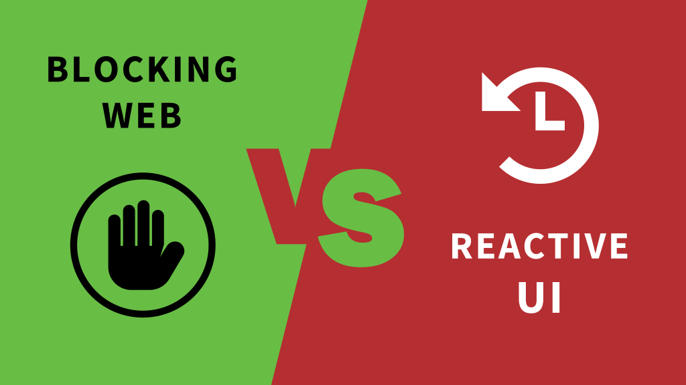

# Blocking web vs Reactive UI

Exploration of difference between:
* blocking java Servlet API and **Spring MVC** framework 
*  reactive stack with java **Spring WebFlux** backend framework and **Angular** javascript UI framework

on implementation of the same search problem.

## Visit youtube video for explanation 

